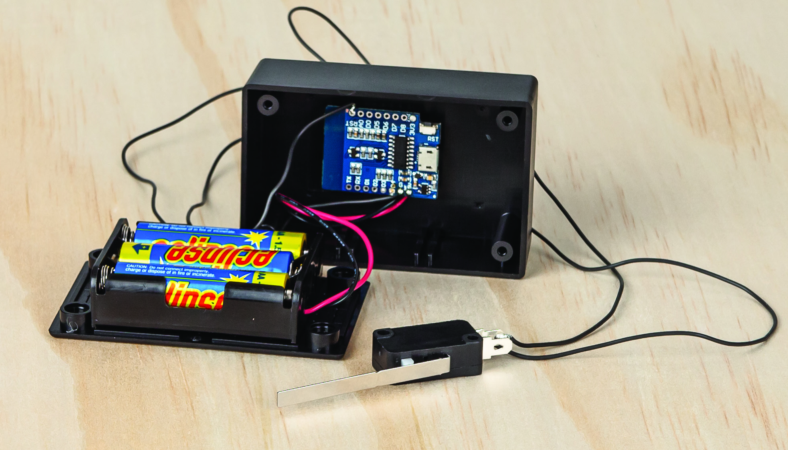
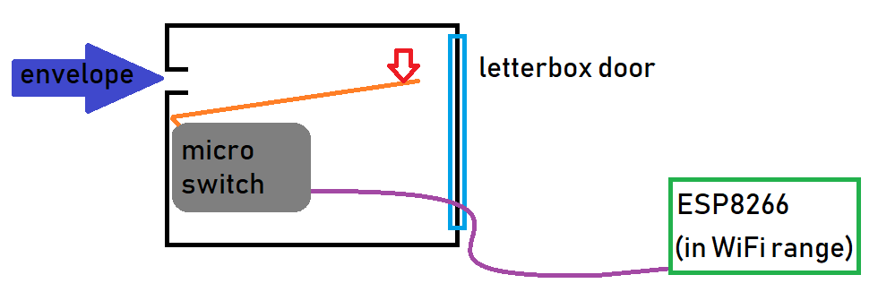
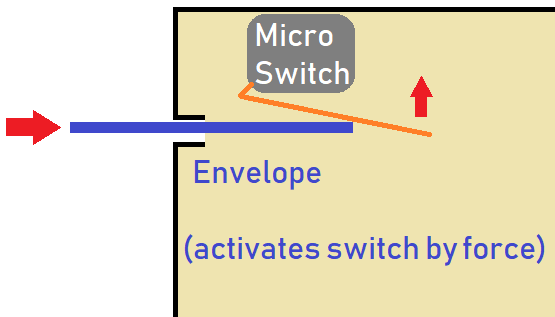
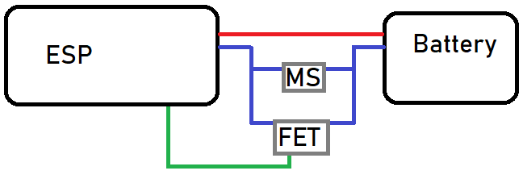

# Mailbox Notifier

Get a quick alert on your phone when you get a new letter in the mailbox!

----
- [Mailbox Notifier](#Mailbox-Notifier)
  - [Desigining](#Desigining)
    - [Objectives and requirements](#Objectives-and-requirements)
    - [Bill of Materials](#Bill-of-Materials)
  - [Using](#Using)
    - [Room for improvement](#Room-for-improvement)

## Desigining

Eagerly waiting for a letter to come in the mail, I was held back checking the mailbox every day, which interrupted my ability to go into town when I needed (just in case I missed the letter arriving)

I figured _**"there must be a better way!"**_ - and set out to design a system that can alert me on the phone when the mail comes in.

### Objectives and requirements

The design of this system has to:

1. Be triggered by a new envelope entering the mailbox.
2. Alert me on my phone, no matter where I am.
3. Be relatively long-lasting, without me having to replace batteries every day.

It really comes down to two components, _mail detection_ and _mail notification_ and they are both exceedingly simple to do; I figured I can use the <https://ifttt.com> service with the trusty **ESP8266**

### Bill of Materials

| Qty | Code                                     | Description              |
| --- | ---------------------------------------- | ------------------------ |
| 1   | [XC3802](https://jaycar.com.au/p/XC3802) | ESP8266 wemos board      |
| 1   | [PH9274](https://jaycar.com.au/p/PH9274) | Battery Holder           |
| 1   | [SM1039](https://jaycar.com.au/p/SM1039) | Microswitch              |
| 1   | [WH3036](https://jaycar.com.au/p/WH3036) | Thin sillicon wire       |
| 1   | [HB6015](https://jaycar.com.au/p/HB6015) | Enclosure (perfect fit!) |
| 1   | [SB2425](https://jaycar.com.au/p/SB2425) | Pack of 4 AA batteries   |

For information on prototyping and assembling, head to https://jaycar.com.au/mailbox-notifier

## Using

As the letter comes in and triggers the switch, the ESP will effectively "turn on" (via a reset).

This causes the esp to send you a _"You've got mail"_ notification on your phone.

The best place to put the switch is such that the whole weight of the letter pushes down on the part of the micro switch arm as far away from the base as possible; this should have enough torque to activate the switch.

If you find that the letter isn't doing it via gravity alone, try mounting it on the roof so that the act of the letter going into the mailbox is what triggers it.

Play around with the design and see how long it lasts. If you have any improvements, feel free to put them as an [issue](https://github.com/) on the github project page.

### Room for improvement

- Use [ZM9012](https://jaycar.com.au/p/ZM9012) for some solar power to extend the battery life further than the batteries themselves, or even use rechargable batteries [SB1737](https://jaycar.com.au/p/SB1737)
- You could use the record-playback module ([XC4605](https://jaycar.com.au/p/XC4605)) to say a nice message to the delivery person, but that will drain the batteries quite a lot.
- A nicer power design would be good, and the original design was intended to be a _self-bootstrapped_ design, where the ESP would be fully isolated from the batteries, until the microswitch turns it on, which then would activate it's own FET to keep it on while it worked. This design means that it would be able to keep itself powered for as long as possible, and then drop to 0 uA, but time got the best of us.

